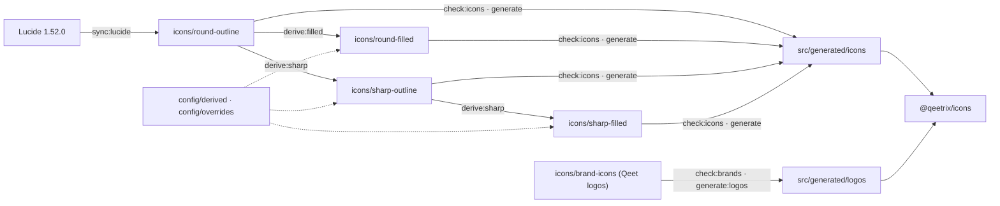

<div align="center">

# 🎨 Qeetrix Icons

**The icon and logo library for Qeet Group products.**

1,863 Lucide icons in **round** and **sharp** shapes, **775 filled** variants, and the **Qeet logo
and wordmark**, as tree-shakeable, fully typed React 19 components, all from one import.

[](https://www.npmjs.com/package/@qeetrix/icons)
[](https://github.com/qeetgroup/qeetrix-icons/actions/workflows/ci.yml)


</div>

```tsx
import { TrashIcon, StarIcon, QeetLogo } from "@qeetrix/icons";

<TrashIcon />                                  // round outline
<StarIcon variant="filled" />                  // round filled
<TrashIcon shape="sharp" />                    // sharp outline
<StarIcon shape="sharp" variant="filled" />    // sharp filled
<QeetLogo height={32} aria-label="Qeet" />     // Qeet logo, exactly as drawn
```

> [!IMPORTANT]
> **Versions 1.0.5 and later are a new library.** They replace the 1.0.0–1.0.4 catalogue entirely
> with Lucide-based icons and brand logos. No earlier icon name, prop, type, or import path carries
> over. If you depend on the old set, pin `@qeetrix/icons@1.0.4` until you migrate.

---

## 📑 Contents

- [✨ Why Qeetrix Icons](#-why-qeetrix-icons)
- [📊 At a glance](#-at-a-glance)
- [📦 Installation](#-installation)
- [🚀 Quick start](#-quick-start)
- [🎨 Icons](#-icons)
- [🟠 Qeet logos](#-qeet-logos)
- [🔎 Catalogue and search](#-catalogue-and-search)
- [🔁 Coming from lucide-react](#-coming-from-lucide-react)
- [📐 Design rules](#-design-rules)
- [🧪 Playground](#-playground)
- [⚡ Performance and package size](#-performance-and-package-size)
- [🏗️ How it is built](#️-how-it-is-built)
- [✅ Quality](#-quality)
- [🛠️ Development](#️-development)
- [📚 Documentation](#-documentation)
- [🚢 Releases](#-releases)
- [⚖️ License](#️-license)

## ✨ Why Qeetrix Icons

[Lucide](https://lucide.dev) is a superb outline icon set. Qeetrix Icons turns it into one
consistent, typed library for every Qeet product (Qeet ID, Qeet Pay, Qeet Logs, Qeet Notify, Qeet
People, Qeet AI), ships Qeet's own logo and wordmark beside it, and adds what Lucide doesn't
provide:

- 🌓 **Filled variants.** Lucide is outline-only. 775 icons gain a filled drawing for selected,
  active, and favourite states, derived from the outline with Skia path operations and reviewed
  one by one, category by category.
- 🔷 **A complete sharp style.** Every icon, outline and filled, also comes with square caps,
  mitered joins, and squared corners, behind a single `shape` prop.
- 🧩 **One API for everything.** Icons and logos share naming, sizing, accessibility defaults, and
  typing. A `variant` the icon or logo doesn't have is a compile-time error.
- 🛡️ **Logos exactly as drawn.** The Qeet logo and wordmark are embedded byte for byte, validated
  for safety, and labelled with the background each file is drawn for.
- 🔎 **Searchable catalogues.** Tags, categories, Lucide's former names, RTL behaviour, and logo
  files and colours, published as data for docs sites and pickers.
- 🌲 **Zero runtime cost you didn't ask for.** No runtime dependencies, no hooks, no side
  effects: bundlers keep only the icons and logos you import.

## 📊 At a glance

| | |
|:--|:--|
| 🎨 **Icons** | 1,863 from Lucide 1.52.0, in Lucide's 42 categories, with Lucide's names and tags |
| 🔷 **Shapes** | `round` (Lucide's drawing, the default) and `sharp`, for every icon |
| 🌓 **Variants** | `outline` for every icon; `filled` for 775, in both shapes |
| 🟠 **Logos** | The Qeet logo and wordmark, Qeet Group's own artwork |
| 🗂️ **Logo files** | 6 (light and dark, and the wordmark with and without its tile), embedded unmodified |
| 📐 **Grid** | 24 × 24, 2-unit stroke, 1-unit padding, `currentColor` |
| ⚛️ **Runtime** | React 19 peer dependency only; no runtime dependencies; no hooks |
| 📦 **Module format** | ESM with TypeScript declarations; every module free of side effects |
| ↔️ **RTL** | 18 reading-direction concepts flagged `mirror` in the catalogue |
| ✅ **Tests** | 649 tests in 12 suites, including a packed-tarball consumer test |

## 📦 Installation

```bash
bun add @qeetrix/icons
# or: npm install @qeetrix/icons
```

React 19 is the only peer dependency. The package ships compiled ESM with type declarations, so
it works in Vite, Next.js, TanStack Start, and React Server Components without extra setup.

## 🚀 Quick start

```tsx
import { BellIcon, SearchIcon, SettingsIcon, StarIcon } from "@qeetrix/icons";

export function Toolbar({ starred }: { starred: boolean }) {
  return (
    <nav className="flex items-center gap-3 text-zinc-700">
      <SearchIcon size={20} />
      <BellIcon variant="filled" aria-label="Notifications" />
      <StarIcon variant={starred ? "filled" : "outline"} className="text-amber-500" />
      <SettingsIcon shape="sharp" strokeWidth={1.5} />
    </nav>
  );
}
```

- 🎨 Icons draw in `currentColor`: they follow the text colour around them.
- 📏 `size` takes pixels or any CSS length; the default is 24.
- 🔷 Switch a whole UI to the sharp style by passing `shape="sharp"`, for example from your own
  wrapper or theme.

## 🎨 Icons

### 🔷 Shapes and variants

Every icon has two shapes, and some icons have two variants. Pick one with two props:

| | `variant="outline"` (default) | `variant="filled"` |
|:--|:--|:--|
| **`shape="round"`** (default) | `<StarIcon />` | `<StarIcon variant="filled" />` |
| **`shape="sharp"`** | `<StarIcon shape="sharp" />` | `<StarIcon shape="sharp" variant="filled" />` |

Filled drawings exist only where the solid form is clean and meaningful: badges, toggles, nav
items, devices, media, files, people, and many more. Open-line icons such as arrows, chevrons,
and text marks, and icons whose outline is clipped open around a badge, are outline-only by
design.

### 🎛️ Props

Every icon accepts the native `<svg>` props (including `ref`, `className`, `style`, and event
handlers) plus:

| Prop | Type | Default | |
|:--|:--|:--|:--|
| `size` | `number \| string` | `24` | Pixels or any CSS length. 14, 16, 20, 24, and 32 are recommended. |
| `variant` | `"outline" \| "filled"` | `"outline"` | Typed per icon to the drawings that exist. |
| `shape` | `"round" \| "sharp"` | `"round"` | Every icon has both. |
| `strokeWidth` | `number \| string` | `2` | Overrides the outline stroke (try 1.5 for dense UIs). |
| `aria-label` | `string` | | Names the icon for assistive technology. |

```tsx
<SearchIcon size={20} className="text-muted" />
<BellIcon variant="filled" aria-label="Notifications" />
<SettingsIcon shape="sharp" strokeWidth={1.5} />
<HeartIcon size="1.25em" style={{ color: "crimson" }} />
```

### 🔤 Naming

Each icon is one named export: its Lucide name in PascalCase plus `Icon`. Categories never appear
in names or import paths.

| Lucide name | Component |
|:--|:--|
| `trash` | `TrashIcon` |
| `circle-check` | `CircleCheckIcon` |
| `clock-12` | `Clock12Icon` |

Lucide's former names (`trash-2` for `trash`, for example) are listed in the catalogue for search
and migration, but are not exported.

### 🧷 Type safety

`variant` is narrowed per icon, so asking for a drawing that doesn't exist fails at compile time:

```tsx
<StarIcon variant="filled" />       // ✅ star has a filled drawing
<ArrowLeftIcon variant="filled" />  // ❌ type error: arrow-left is outline-only
```

To accept any icon, for example in a button component, type the prop as
`ComponentType<IconProps<"outline">>`: every icon has an outline drawing, so every icon fits.

```tsx
import type { ComponentType } from "react";
import type { IconProps } from "@qeetrix/icons";

function ToolbarButton({ icon: Icon, label }: { icon: ComponentType<IconProps<"outline">>; label: string }) {
  return (
    <button type="button" aria-label={label}>
      <Icon size={16} />
    </button>
  );
}
```

### ♿ Accessibility and RTL

- Icons are **decorative by default**: `aria-hidden="true"` and `focusable="false"`. A non-empty
  `aria-label` or `aria-labelledby` turns an icon into `role="img"`. Explicit props always win.
- Each icon's **directionality** is in the catalogue: `mirror` for reading-direction concepts
  such as undo, reply, send, log-in, and indentation, and `preserve` for everything else.
  Physical arrows and chevrons never mirror. The library never flips an icon itself; your RTL
  layer decides. See [docs/rtl.md](docs/rtl.md).

## 🟠 Qeet logos

```tsx
import { QeetLogo, QeetWordmarkLogo } from "@qeetrix/icons";

<QeetLogo aria-label="Qeet" />                                      // on light surfaces
<QeetLogo variant="dark" aria-label="Qeet" />                       // on dark surfaces
<QeetWordmarkLogo height={28} aria-label="Qeet" />                  // tile, on light surfaces
<QeetWordmarkLogo variant="dark" height={28} aria-label="Qeet" />   // tile, on dark surfaces
<QeetWordmarkLogo variant="plain" height={24} aria-label="Qeet" />  // no tile, on light surfaces
<QeetWordmarkLogo variant="plain-dark" height={24} aria-label="Qeet" />
```

Each logo renders its **SVG file, unmodified**, as an ``. Nothing in the artwork is converted
or recoloured; a test proves every file is embedded byte for byte. Because each logo is its own
image, its ids and styles never clash with the page or with another logo, and it works in Server
Components.

Each logo has a file for light surfaces (`default`) and one for dark surfaces (`dark`):

| Component | What it is | `default` (light surfaces) | `dark` (dark surfaces) |
|:--|:--|:--|:--|
| `QeetLogo` | the Qeet "q" mark | graphite bowl, orange descender | white bowl, orange descender |
| `QeetWordmarkLogo` | **Qeet.** in a tile | graphite tile, white letters | white tile, graphite letters |

The wordmark also comes without the tile, as two more files: `plain` (graphite letters, for light
surfaces) and `plain-dark` (white letters, for dark surfaces), cropped to the letters themselves.

| Prop | Type | Default | |
|:--|:--|:--|:--|
| `variant` | per logo | `"default"` | `"default"`, `"dark"`, and for the wordmark `"plain"` and `"plain-dark"`. Typed to the files that exist. |
| `height` | `number \| string` | `24` | Width follows the logo's own aspect ratio. |
| `width` | `number \| string` | from `height` | Give only `width` to derive `height` instead. |
| `alt` / `aria-label` | `string` | | Names the logo; otherwise it is decorative. |

Other native `` props (`className`, `style`, `loading`, `decoding`, …) pass through. Logos
keep their colours by design, so CSS cannot recolour them.

The wordmark is **Qeet.** set in Qeet Display Bold (Cal Sans UI Geo Bold, SIL OFL 1.1), kerned by
eye pair by pair, with the full stop in Qeet orange, and converted to outlines, so it renders the
same without the font. The tile is square-cornered and centred on the capitals. The stop is the
same orange in all four files. Use the tile where the mark must stand out on a busy or coloured
surface; use the plain letters in headers, footers and anywhere the surface is already calm.

An image cannot see your app's theme, so pick the file the same way your theme is picked. With a
class-based theme (`.dark` on `<html>`, as Qeetrix UI does), render both and let CSS show one:

```tsx
<QeetLogo className="inline-block dark:hidden" aria-label="Qeet" />
<QeetLogo variant="dark" className="hidden dark:inline-block" aria-label="Qeet" />
```

The same pattern works for `QeetWordmarkLogo`. The Qeetrix UI playground's **Brand** page
(`#/brand`) shows both in light and dark, at every size, and inside real app layouts.

If your theme follows the operating system instead, use `prefers-color-scheme` in your CSS the
same way. Prefer the class approach whenever the app has its own theme toggle, or the logo and
the page will disagree.

Both are first-party (`firstParty: true` in `config/brands.json`, licence class `first-party`), and
the validator accepts no other kind. A logo's name is its slug in PascalCase plus `Logo`
(`qeet-wordmark` → `QeetWordmarkLogo`); icons always end in `Icon` and logos in `Logo`, so the two
families never collide. The Qeet name and mark are trademarks of Qeet Group.

> [!NOTE]
> **Third-party brand logos are not included.** Earlier versions shipped 7,429 logos from theSVG.
> For a GitHub, Google, or Slack logo, use [theSVG](https://thesvg.org) directly, for example
> `@thesvg/react`, one logo per import.

## 🔎 Catalogue and search

Machine-readable catalogues for docs sites, icon pickers, and tooling. They are never needed to
render, and the package root never imports them.

```ts
import { iconManifest, logoManifest } from "@qeetrix/icons/manifest";

// Icons tagged "delete", including Lucide's former names
const deleteIcons = iconManifest.icons.filter(
  ({ tags, aliases }) => tags.includes("delete") || aliases.includes("trash-2"),
);

// Icons with a filled drawing in the "account" category
const filledAccount = iconManifest.icons.filter(
  ({ categories, variants }) => categories.includes("account") && variants.includes("filled"),
);

// The Qeet mark's files, with the background each is drawn for
const qeetFiles = logoManifest.logos.find(({ id }) => id === "qeet")?.variants;
```

| Icon entry | Logo entry |
|:--|:--|
| `id`, `name`, `componentName` | `id`, `componentName`, `title` |
| `category`, `categories` | `collection`, `categories` |
| `variants`, `shapes` | `variants` (with `background`), `defaultVariant` |
| `tags`, `aliases` | `aliases`, `hex` (brand colour) |
| `directionality` | `license`, `website`, `guidelines`, `source` |

## 🔁 Coming from lucide-react

The artwork is Lucide's, so most screens move over with an import change:

| `lucide-react` | `@qeetrix/icons` |
|:--|:--|
| `import { Star } from "lucide-react"` | `import { StarIcon } from "@qeetrix/icons"` |
| `<Star size={20} strokeWidth={1.5} />` | `<StarIcon size={20} strokeWidth={1.5} />` (same props) |
| `<Star className="text-amber-500" />` | `<StarIcon className="text-amber-500" />` (same `currentColor`) |
| Outline only | Add `variant="filled"` where a filled drawing exists |
| Round only | Add `shape="sharp"` for the sharp style |
| No logos | `QeetLogo` and `QeetWordmarkLogo` from the same package |

Names follow Lucide 1.52.0, so a few older lucide-react names differ (`Trash2` is `TrashIcon`
here); the catalogue's `aliases` field maps them. `absoluteStrokeWidth` is not supported.

## 📐 Design rules

Every derived drawing follows the same rules, so families look alike and nothing surprises you at
16 px.

| | Round filled | Sharp (outline and filled) |
|:--|:--|:--|
| 📏 **Footprint** | Same painted extent as the outline | Same drawing, square caps, mitered joins (miter limit 4) |
| 🧱 **Bodies and details** | Bodies solid; details cut as 2-unit negative lines | Small corner roundings become sharp corners; acute tips come to a point |
| ✂️ **Cuts that reach an edge** | Run straight through, so parts separate cleanly (calendar header, file dog-ear, mail flap) | Identical to round: both shapes part the same way |
| 🔗 **Attached parts** | Legs, handles, stands, cords stay joined | Line ends that stop on another stroke are trimmed so no cap pokes out |
| 🪟 **Layers** | Front parts sit in a 1-unit gap (clipboard clip, copy's front sheet, wheels) | Same roles as round, part for part |
| 🔲 **Border** | Inside Lucide's 1-unit padding | Never crosses it: a corner that would is cut flat, minimally, symmetrically |
| ⚪ **Dots** | Round holes | UI dots square (ellipsis, bullets, keys, pips); figurative dots round (eyes, spots, drops) |
| 🌿 **Organic shapes** | As the outline | Circles, faces, animals, fruit, hands, and coastlines stay round |
| 🔤 **Letters** | As the outline | An A's apex stays level with the letters beside it |

Where no rule gives a clean result, a reviewed, hand-drawn override takes the derivation's place.
Full detail: [docs/filled.md](docs/filled.md), [docs/sharp.md](docs/sharp.md), and
[docs/design.md](docs/design.md).

## 🧪 Playground

An internal, unpublished playground for browsing and visual review, with separate **Icons** and
**Logos** pages:

```bash
bun run playground
```

- 🎨 **Icons:** category sidebar, search across names, tags, and former names, Round/Sharp and
  variant switches, size, stroke, and colour controls, and an inspector with every shape and
  variant, real-size previews, construction grid, light/dark surfaces, RTL preview, and copyable
  JSX.
- 🟠 **Logos:** both Qeet logos on a light/dark/transparent background switch, at their true
  aspect ratio, with an inspector showing every file on the background it's drawn for.
- ⌨️ **Everywhere:** a ⌘K command palette across icons and logos, shareable URLs, keyboard
  navigation, and light and dark themes.

## ⚡ Performance and package size

- 🌲 **Production builds include only what you import.** Every module is free of side effects and
  the root is a list of static re-exports, so bundlers drop every unused icon and logo. Tests
  bundle real consumers to prove it.
- 📥 **One import, everything included.** Importing `@qeetrix/icons` gives you all icons and logos.
  In Node (server rendering, test runners) the first import therefore loads every module:
  measured cold on a development laptop, about 1.6 s. It is paid once per process.
- 🔥 **Dev servers** that pre-bundle a dependency's root, such as Vite and Next.js, process the whole
  package on the first start after installing or upgrading, then reuse their cache.
- 🪶 **Per-icon imports** are available when you need the leanest possible module graph:
  `import { TrashIcon } from "@qeetrix/icons/icons/trash"`.
- 📦 **Package:** about 0.7 MB packed and 5.5 MB unpacked. Only compiled code ships; no source
  SVGs.

## 🏗️ How it is built

Every icon source file is written by a tool from a pinned Lucide release, and everything generated
is committed, validated in CI, and reproducible.



- 🌓 **Filled drawings** are derived with CanvasKit (Skia) path operations from per-category recipes
  in [config/derived/](config/derived/README.md): bodies filled to the outline's painted extent,
  details cut as negative lines, crossing lines cleared by a gap. See
  [docs/filled.md](docs/filled.md).
- 🔷 **Sharp drawings** square corner roundings at their tangent intersections, point acute tips,
  and then fit the whole icon: nothing crosses the padding, no cap pokes past the stroke it ends
  on, joined strokes form one corner, and mirror twins get the same cut. See
  [docs/sharp.md](docs/sharp.md).
- ✍️ **Overrides:** 78 hand-drawn replacements in `config/overrides/` cover the few drawings rules
  cannot get right. Each is stamped with the SHA-256 of the outline it was drawn against, so a
  Lucide upgrade flags it for review instead of silently drifting.
- 🟠 **Logos** are Qeet's own SVG files, validated (no scripts, event handlers, or external
  references) and embedded as lossless `data:` URIs. See [docs/logos.md](docs/logos.md).

### 🗃️ Repository layout

```text
config/
  derived/            Per-category tables: filled recipes and roles, keepRound, tipHeight
  overrides/          Hand-drawn, hash-stamped replacements for derived drawings
  lucide.json, brands.json, categories.ts, icon-system.ts, icon-metadata.ts, …
icons/
  round-outline/      Lucide outlines, unchanged
  round-filled/       Derived filled drawings
  sharp-outline/      Derived sharp outlines
  sharp-filled/       Derived sharp filled drawings
  brand-icons/        The Qeet logo and wordmark files
scripts/              Sync, derivation, validation, and generation tools
src/
  index.ts            The package entry: every icon and logo
  manifest.ts         The catalogue entry: iconManifest and logoManifest
  generated/          Generated icon and logo modules, export lists, and catalogues
  runtime/, types/    The shared props helper, logo renderer, and public types
playground/           Internal visual QA app (not published)
tests/                Vitest suites, including a packed-tarball consumer test
docs/                 Design, API, pipeline, and process documentation
```

## ✅ Quality

- 🧾 **Validation:** every source SVG is checked against 24 rules (`QXI-*` codes): structure,
  allowed elements and attributes, paint, the grid, naming, categories, duplicates, and that every
  icon has all its drawings in both shapes. See [docs/validation.md](docs/validation.md).
- 🔲 **Border proof:** a test measures every sharp drawing with CanvasKit and fails if anything
  paints past the padding where the round drawing doesn't. The few curved ends too short to trim
  are listed with their measured overshoot, and none may get worse.
- 🔁 **Reproducibility:** `check:filled`, `check:sharp`, `check:generated`, and `check:logos` fail
  if any derived or generated file differs from what the tools produce.
- 📦 **Real consumers:** the package test packs the tarball, installs it in a fresh project,
  typechecks strict consumers under `bundler` and `nodenext` resolution, renders icons in both
  shapes, and bundles them to prove tree-shaking.
- 👀 **Visual review:** every filled and sharp drawing was reviewed by eye at 64, 24, and 16 px,
  category by category. See [docs/visual-qa.md](docs/visual-qa.md).

## 🛠️ Development

Bun only (1.3.14), strict TypeScript, ESM, Biome, and Vitest.

```bash
bun install
bun run lint && bun run typecheck && bun run test
```

| Area | Commands |
|:--|:--|
| ✅ Quality | `lint`, `typecheck`, `test`, `build` |
| 🎨 Icons | `sync:lucide [version]`, `derive:filled`, `derive:sharp`, `generate` |
| 🎯 One category | `derive:filled --category <id>`, `derive:sharp --category <id>` |
| ✍️ Overrides | `stamp:override <file>` |
| 🔍 Icon checks | `check:icons`, `check:filled`, `check:sharp`, `check:generated` |
| 🟠 Logos | `generate:logos` |
| 🔍 Logo checks | `check:brands`, `check:logos` |
| 🧪 Playground | `playground`, `playground:build` |

Ground rules:

- 🚫 **Never hand-edit tool-written files**: the derived and Lucide folders in `icons/`,
  `config/lucide.json`, `config/categories.ts`, `src/generated/`, or `icon-manifest.json`. Change
  the inputs and rerun the tool. The Qeet logo files and `config/brands.json` are edited by hand,
  then checked with `check:brands`.
- 🔄 **`sync:lucide` leaves the repository consistent**: it re-derives and regenerates everything
  downstream.
- ⬆️ **A missing or flawed outline belongs upstream** in Lucide; a filled or sharp result is changed
  through its category's file in [config/derived/](config/derived/README.md), an override, or the
  sharp rules.
- 🤖 **CI and the release gate run** lint, typecheck, tests, every `check:*` command, the build, and
  the playground build.

## 📚 Documentation

| Guide | |
|:--|:--|
| 🧩 [API](docs/api.md) | Entry points, props, types, the catalogue schema, and versioning |
| 📐 [Design](docs/design.md) | Grid, stroke, padding, and how filled and sharp drawings are formed |
| 🌓 [Filled drawings](docs/filled.md) | Roles, inference, recipes, overrides, and how to add a filled icon |
| 🔷 [Sharp style](docs/sharp.md) | Sharpening rules, fitting, kept-round elements, letter heights |
| 🟠 [Qeet logos](docs/logos.md) | Files, catalogue, components, and backgrounds |
| 🪶 [Lucide](docs/lucide.md) | What comes from Lucide, syncing, and upgrading |
| 🔤 [Naming](docs/naming.md) · ♿ [Accessibility](docs/accessibility.md) · ↔️ [RTL](docs/rtl.md) | Conventions |
| 🏗️ [Architecture](docs/architecture.md) · ⚙️ [Generation](docs/generation.md) · 🧾 [Validation](docs/validation.md) | How the pipeline works |
| 👀 [Visual QA](docs/visual-qa.md) · 🤝 [Contributing](docs/contributing.md) · 🚢 [Releases](docs/releases.md) | Process |

The full index is [docs/README.md](docs/README.md).

## 🚢 Releases

- 🏷️ **Published on npm** as [`@qeetrix/icons`](https://www.npmjs.com/package/@qeetrix/icons),
  with signed provenance from GitHub Actions, and as a GitHub Release for each version.
- 🔢 **Versioning:** the Version workflow raises the patch version on every pull request unless
  it is already raised; merging to `main` publishes that version, tags it, and opens the GitHub
  Release. A Rollback workflow moves the `latest` tag back to an earlier version.
- 📝 **Changes** are recorded in [CHANGELOG.md](CHANGELOG.md). Read
  [docs/releases.md](docs/releases.md) before any release work.

## ⚖️ License

- 💻 **Package code:** MIT © Qeet Group.
- 🎨 **Icons:** the artwork, the derived filled and sharp drawings, and the generated icon components
  are based on [Lucide](https://lucide.dev), ISC © Lucide Icons and Contributors. Some Lucide icons
  derive from Feather, MIT © Cole Bemis.
- 🟠 **Qeet logos:** proprietary artwork © Qeet Group (`LicenseRef-Qeet`). The Qeet name and mark
  are trademarks of Qeet Group.

`package.json` declares `"license": "SEE LICENSE IN LICENSE"`; the full notices are in
[LICENSE](LICENSE).

### 🙏 Acknowledgements

Built on [Lucide](https://lucide.dev) and [Feather](https://feathericons.com) for the icons, and
[Skia](https://skia.org)'s CanvasKit for the filled and sharp geometry.
